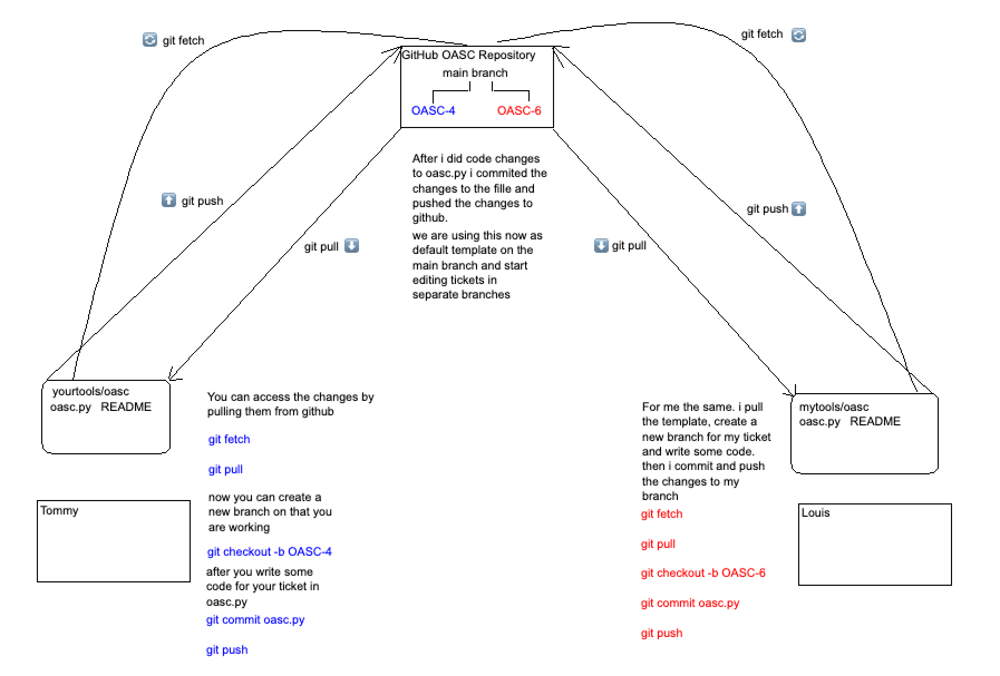

<h1>OASC</h1>

OpenAI Security Console - Python3 AI-driven Pen Testing Framework

<h2>Project Management</h2>
<h3><a href="https://z0nd3rl1ng.atlassian.net/jira/software/c/projects/OASC/boards/1?selectedIssue=OASC-1&atlOrigin=eyJpIjoiNjEzZTVmMTRhOWM5NDFlMGE4Yjc3NGE4MDIwNGI1NDUiLCJwIjoiaiJ9">Atlassian Kanban Board 📋</a></h3>
< 

 <!--<h3>GET STARTED</h3>

 create an <a href="https://beta.openai.com/account/api-keys">openAI API KEY</a> and paste it into the script!
         
         python3 oasc.py-->
