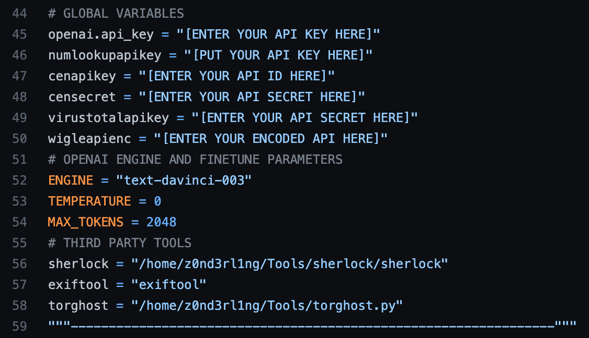

<h2>AI-powered Cybersecurity Framework</h2>

<h3>Requirements</h3>
 

  Enter your API keys for all third party services and set the paths after installing 
  <ul>
    <li><a href="https://exiftool.org/">exiftool</a></li>
    <li><a href="https://github.com/sherlock-project/sherlock">sherlock</a></li>
    <li><a href="https://github.com/SusmithKrishnan/torghost">torghost</a></li>

<ul><li><h3><a href="https://z0nd3rl1ng.atlassian.net/jira/software/c/projects/OASC/boards/1?selectedIssue=OASC-1&atlOrigin=eyJpIjoiNjEzZTVmMTRhOWM5NDFlMGE4Yjc3NGE4MDIwNGI1NDUiLCJwIjoiaiJ9">Atlassian Kanban Board 📋</a></h3></li></ul>

