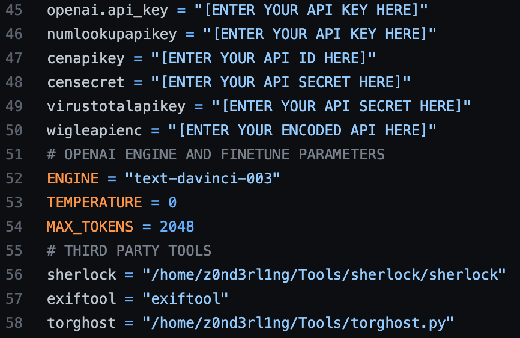

<h2>AI-powered Cybersecurity Framework</h2>

<h3>Requirements</h3>
 

  Enter your API keys for all third party services and set the paths after installing <a href="https://exiftool.org/">exiftool</a>, <a href="https://github.com/sherlock-project/sherlock">sherlock</a> and <a href="https://github.com/SusmithKrishnan/torghost">torghost</a>

